# The cheapest connected temperature sensor for dummies (like me)

The main objective is to create a connected sensor with the lowest knowledge from electronics. No code, no welds (or minimal), no electronical skills etc.

What you'll need.

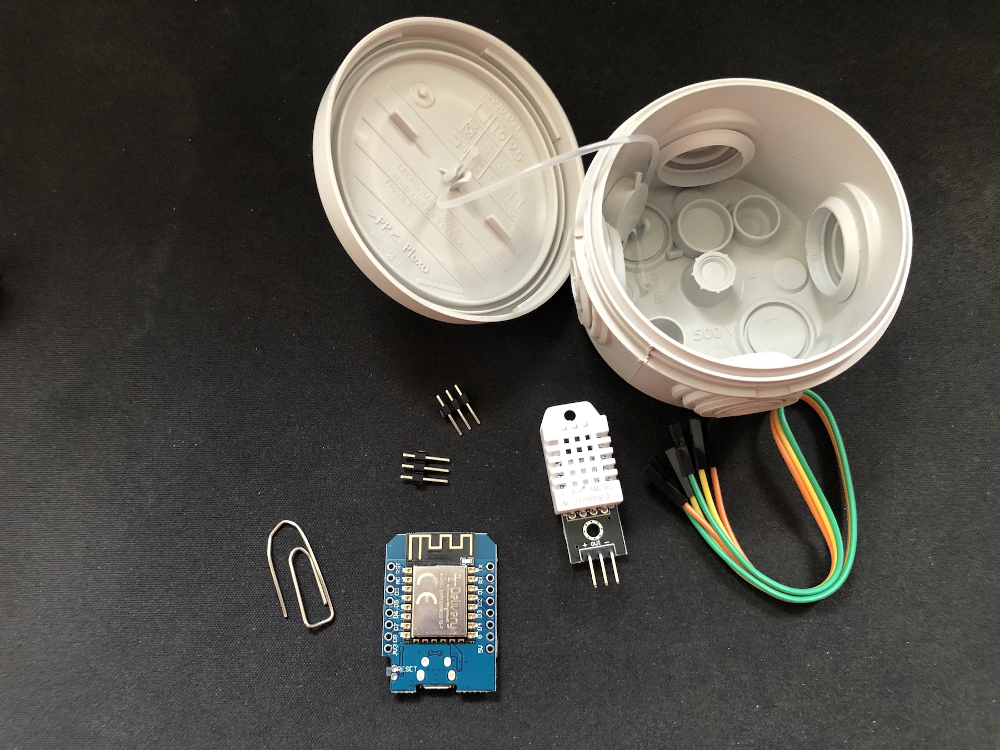

| Item                        | Price | Description                                              |
| --------------------------- | ----- | -------------------------------------------------------- |
| D1 Mini NodeMCU ESP8266-12F | ~5€   | price is from Amazon (France)                            |
| DHT22 AM2302                | ~7€   | price is from Amazon (France)                            |
| 1 box                       | ~3€   | i've bought a small box for outside electrical enclosure |
| total                       | ~15€  |                                                          |

You should also use a raspberry pi or any computer to collect and display data. _(we'll see it later)_

## D1 Mini

First, i've tried to find the best suitable microcontroller. I've already played with ESP8266 in 2015 and since, ESP32 has became the flagship of Espressif. Strangly, i can't find any competitor as cheap as ESPxxx. To take a measurement and go to sleep, ESP8266 seems the best choice.

D1 mini offers a true board that accepts 5v but also it's easy to program just by plugging a USB cable.

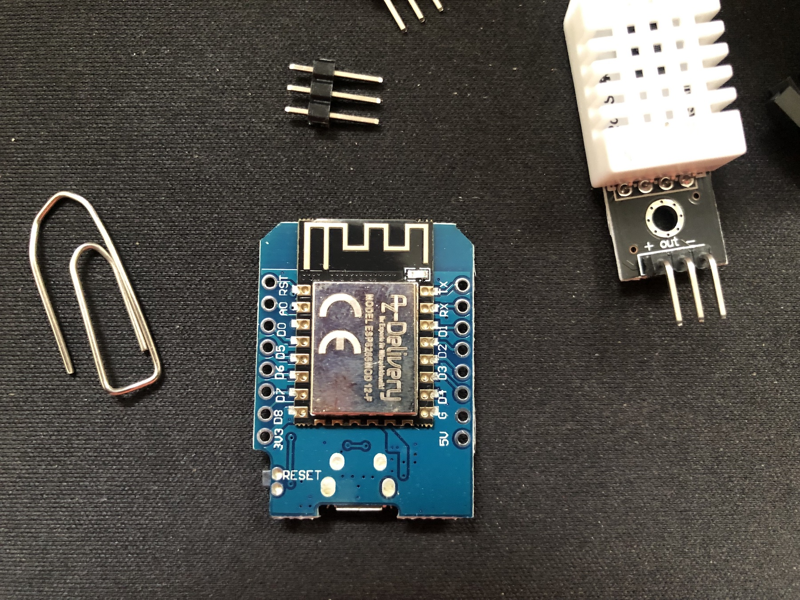

### Flashing the D1

World is soo beautiful (isn't it?). Back to 2015, it was difficult to program those kind of devices. You had to know C language but also any tricks concerning the update of the firmware, deep sleep, etc.

A big leap was made thanks to the community.
And it's now possible to avoid any software programming.

[Tasmota](https://tasmota.github.io/docs/) does exactly what i've dreamed of. It offers to dynamically set up your device by using a website ❤️. The only thing to do is to flash your device with the latest firmware. [Have a look at this page, you should find everything you need to do it](https://tasmota.github.io/docs/Getting-Started/).

```
▶ esptool.py --port /dev/tty.usbserial-1120 write_flash -fs detect -fm dout 0x0 tasmota.bin
```

### Soldering stuffs

**BEFORE DOING ANYTHING, you must flash your D1 mini (after soldering the reset pin to d0, it'll be not possible anymore)**

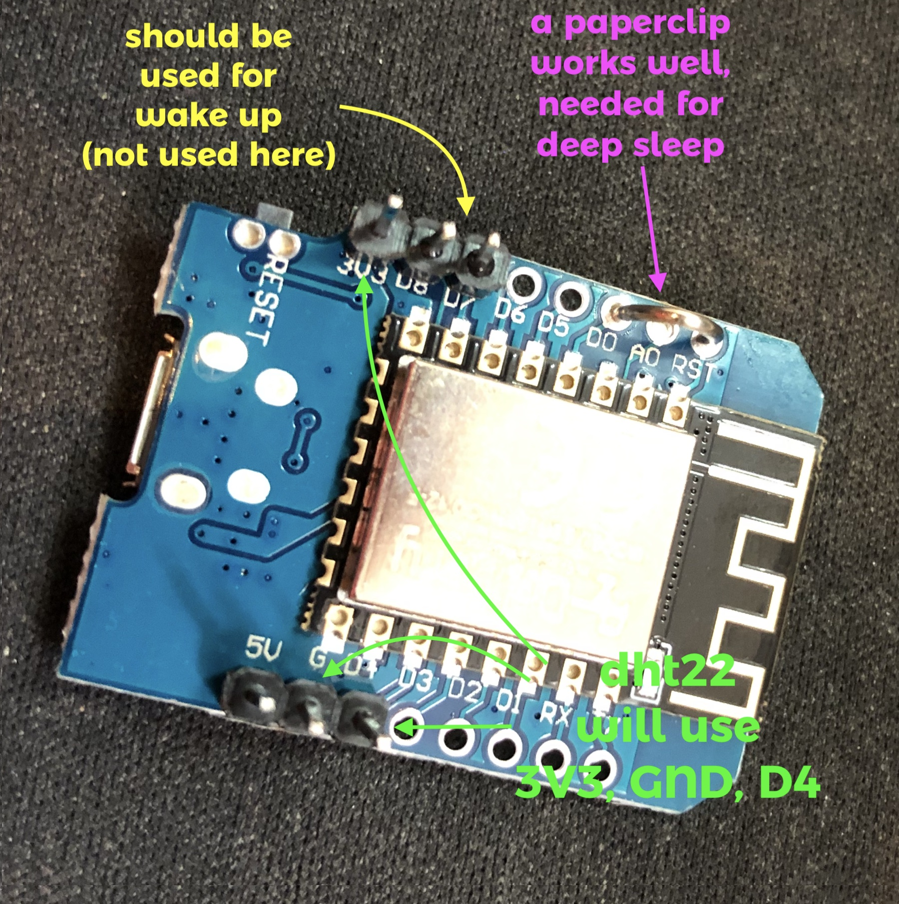

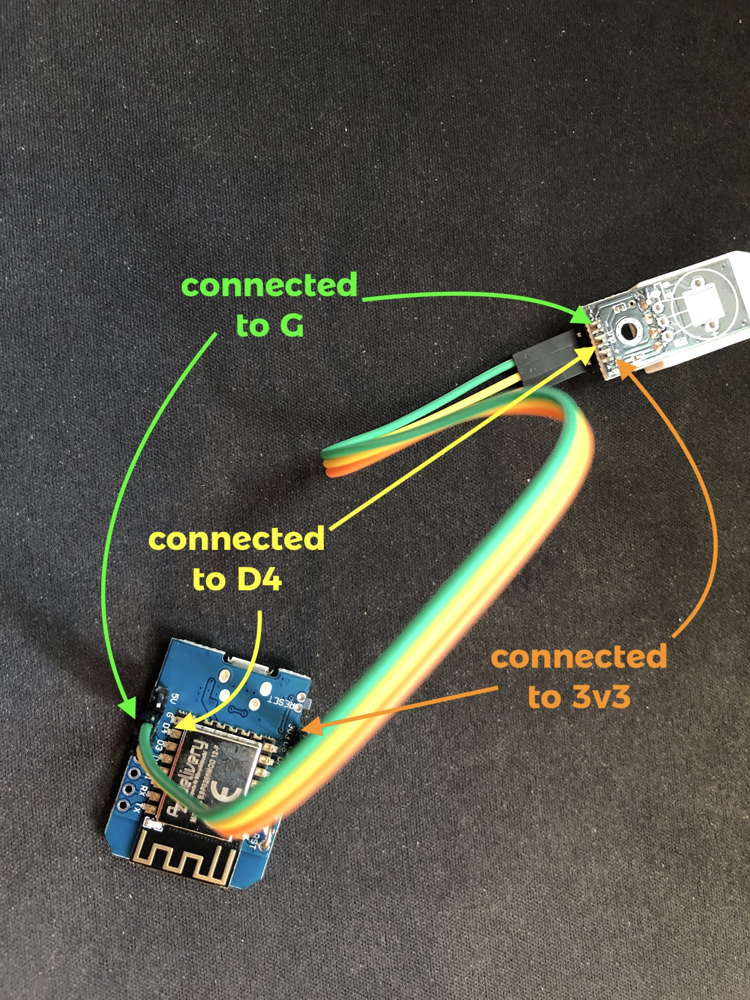

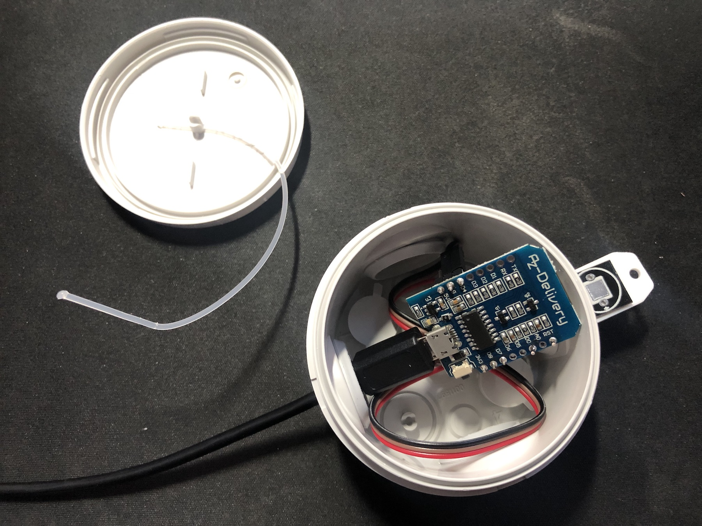

### Configure a Server-Side

To analyse the collected temperatures, we need a sort of tank as commonly named a database 😝.

Tasmota communicates with the outside by using the [MQTT protocol](https://mqtt.org/).

Also, you could use several [Smart Home Platforms](https://tasmota.github.io/docs/Integrations/).

But, because we are focusing on collecting temperatures, we just need a MQTT broker.

Depending on your environment, `apt install mosquitto` or `brew install mosquitto` should be fine.

### Configure Tasmota

On the first boot, your D1 should provide a `tasmota-xxxx-xxxx` hostpot.

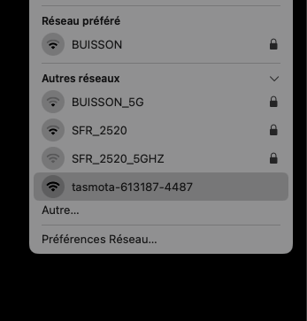

Select it, and go to http://192.168.4.1. You should select your own WIFI.

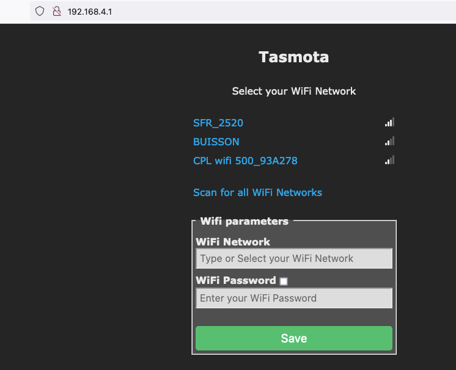

Go to configure and configure modules. Select `Generic (18)` and set **D4** to `AM2301`.

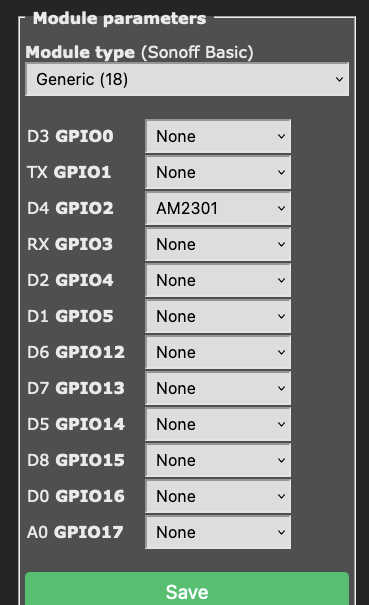

After a reboot, you should see temperature.

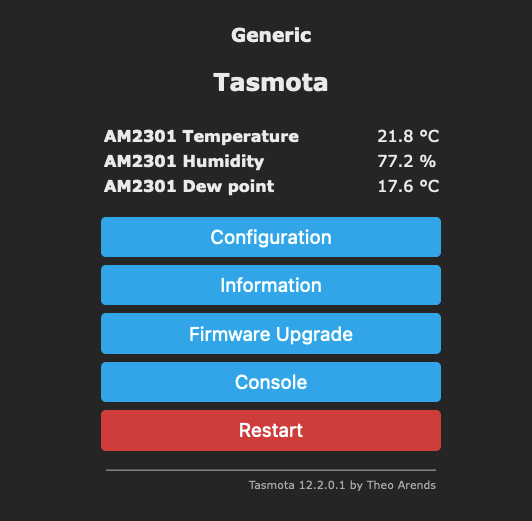

Set up the MQTT parameters _(you can also override the topic name)_

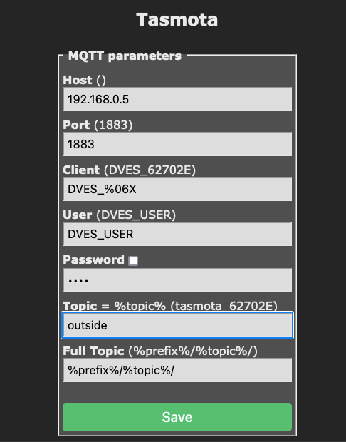

I advice you to set up a more human readable name of your device.

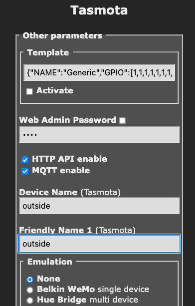

it's much better

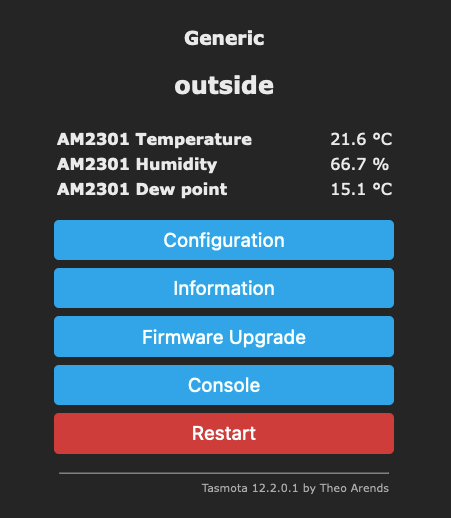

By default, the D1 will report temperature every 300 seconds.
You could use the [Deep Sleep feature](https://tasmota.github.io/docs/DeepSleep/) to gain autonomy and reduce consumption.

```
// will report a metric every 10 minutes and go into deep sleep right after.
▶ mosquitto_pub -h 192.168.0.5 -t cmnd/outside/DeepSleepTime -m 600
```

You should see logs like this :

```
▶ mosquitto_sub -h 192.168.0.5 -t tele/# -v
tele/outside/LWT Online
tele/outside/STATE {"Time":"2022-10-20T10:29:14","Uptime":"0T00:00:08","UptimeSec":8,"Heap":28,"SleepMode":"Dynamic","Sleep":50,"LoadAvg":19,"MqttCount":1,"Wifi":{"AP":1,"SSId":"BUISSON","BSSId":"1C:3B:F3:B3:93:DF","Channel":10,"Mode":"11n","RSSI":30,"Signal":-85,"LinkCount":1,"Downtime":"0T00:00:03"}}
tele/outside/SENSOR {"Time":"2022-10-20T10:29:14","AM2301":{"Temperature":21.7,"Humidity":75.8,"DewPoint":17.2},"TempUnit":"C"}
tele/outside/LWT Offline
```

### Bonus Track, autonomous temperature sensor

You can recycle a Li-ion battery based on 18650 stick.
Depending of your battery, you could find [2 types of voltage : 3.7v or 4.2v](https://www.tycorun.com/blogs/news/18650-battery-4-2v-vs-3-7v-comparison-guide-for-18650-with-different-voltages).

You should check the voltage with a voltmeter. For example, my recycled "usb-battery-charger" pretented to be 3.7v but in fact was 4.2v.

4.2v should be linked with the 5v pin and i suppose the 3.7v with the 3.3.

**Using the 5v seems more secure for your installation.**

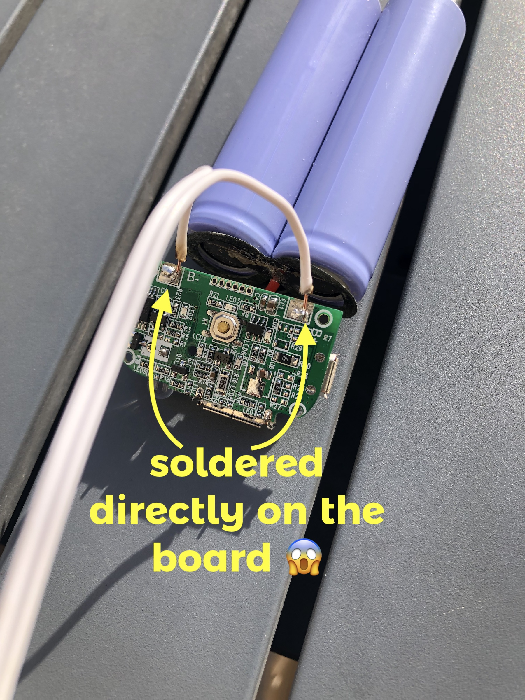

It's important to be careful not to lose the ability to turn off your device. If you solder both wires, you won't be able to restart your device. _(the reset button doesn't work on deep sleep)_.

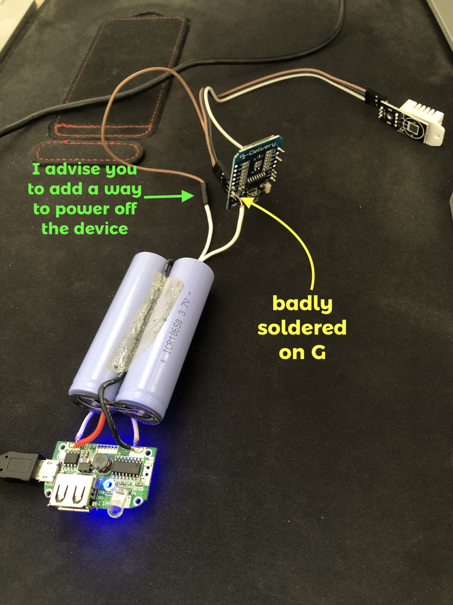

Also, remember to waterproof and isulate the DHT22 because D1 mini and battery should heat up.

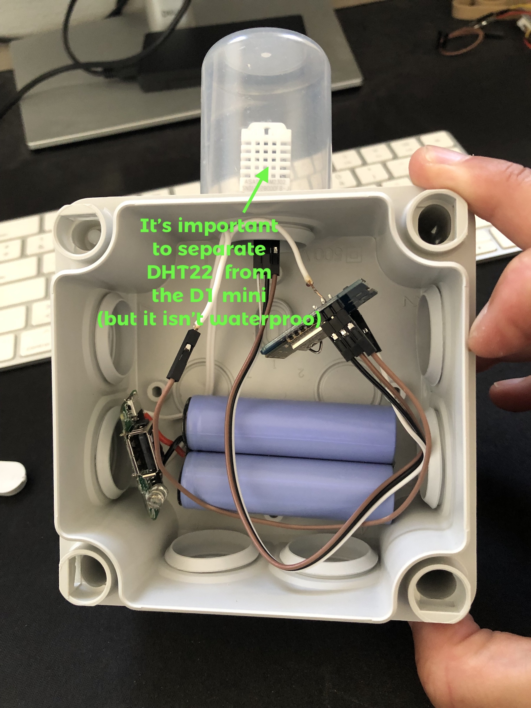
