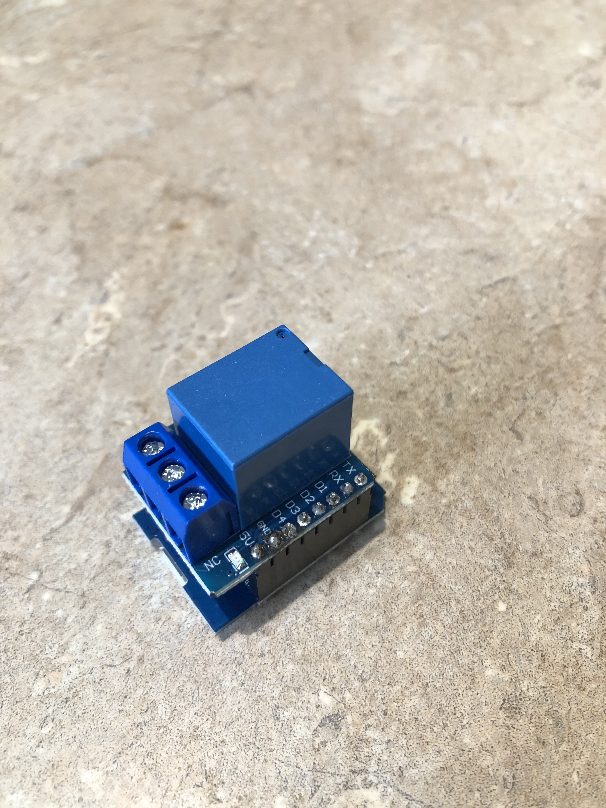
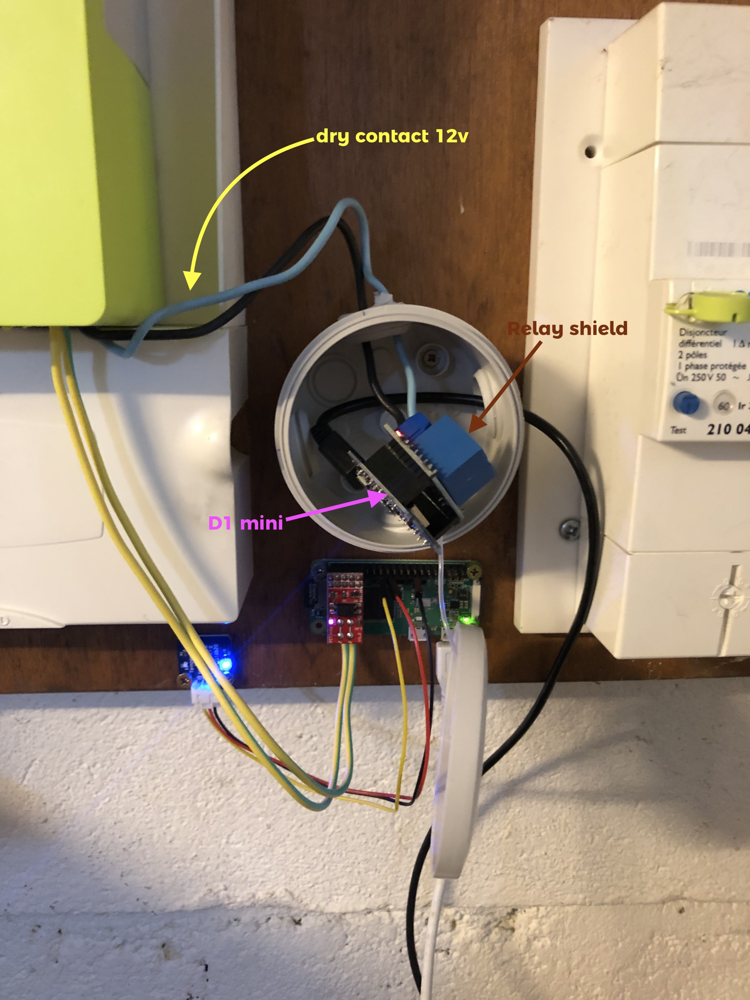
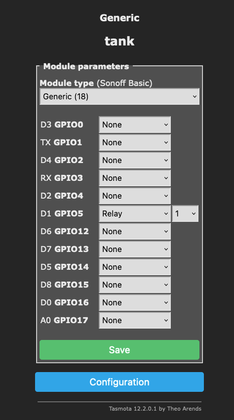
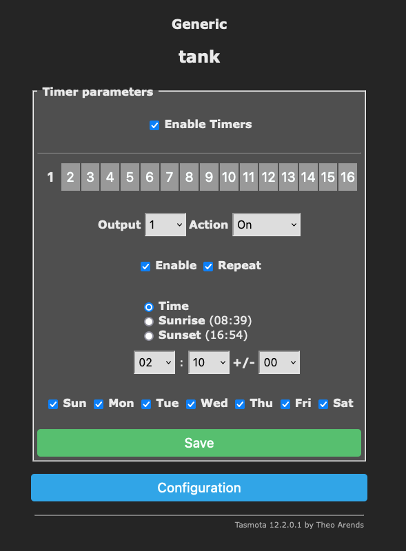
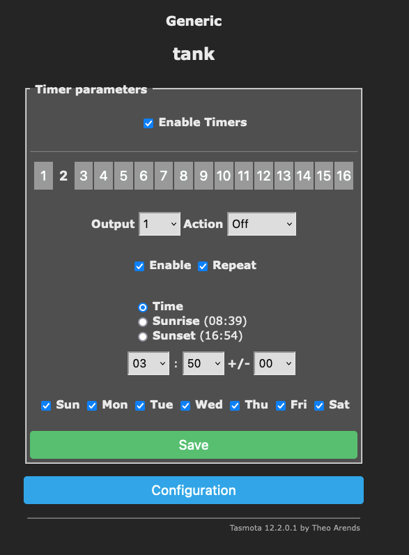

# Control your own hot water production

Basically, we have two way to heat water at home.
By using a electric resistor or by using non-renewal energy (gaz, petrol, etc). If your are in full-electric house like 40% of french people, your water tank is heated by an electric resistor.
It is generally remote-controlled by a switch managed by your electricity provider.

So you don't really control when your water is heated nor be able to heat it remotly. To reduce cost and consume electricity smartly, it could be useful to be able to manager by oneself our hot water production.

## With a note of 10€ we can make it possible

| Item                        | Price | Description                                              |
| --------------------------- | ----- | -------------------------------------------------------- |
| D1 Mini NodeMCU ESP8266-12F | ~5€   | price is from Amazon (France)                            |
| Canal Shield Relais         | ~6€   | price is from Amazon (France)                            |
| 1 box                       | ~3€   | i've bought a small box for outside electrical enclosure |
| total                       | ~14€  |                                                          |

After a little search on Amazon, i've found a shield for the D1 mini. That great because D1 mini means [tasmota](tasmota.github.io/), and it'll help a lot in avoiding programming ^\_^.

So you just have to unplug dry contact wire linked on the Linky and plug them on the shield. _(NO means Normally Open and NC Normally Closed - our initial step is "no")_

## Configure Tasmota

As usual with a D1 mini, we have to select the generic module type (18) and in our case, D1 GPIO5 has to be seen as a Relay. The shield use it to interact with the D1.

Plan your own schedules with Tasmota.

And voilà!
