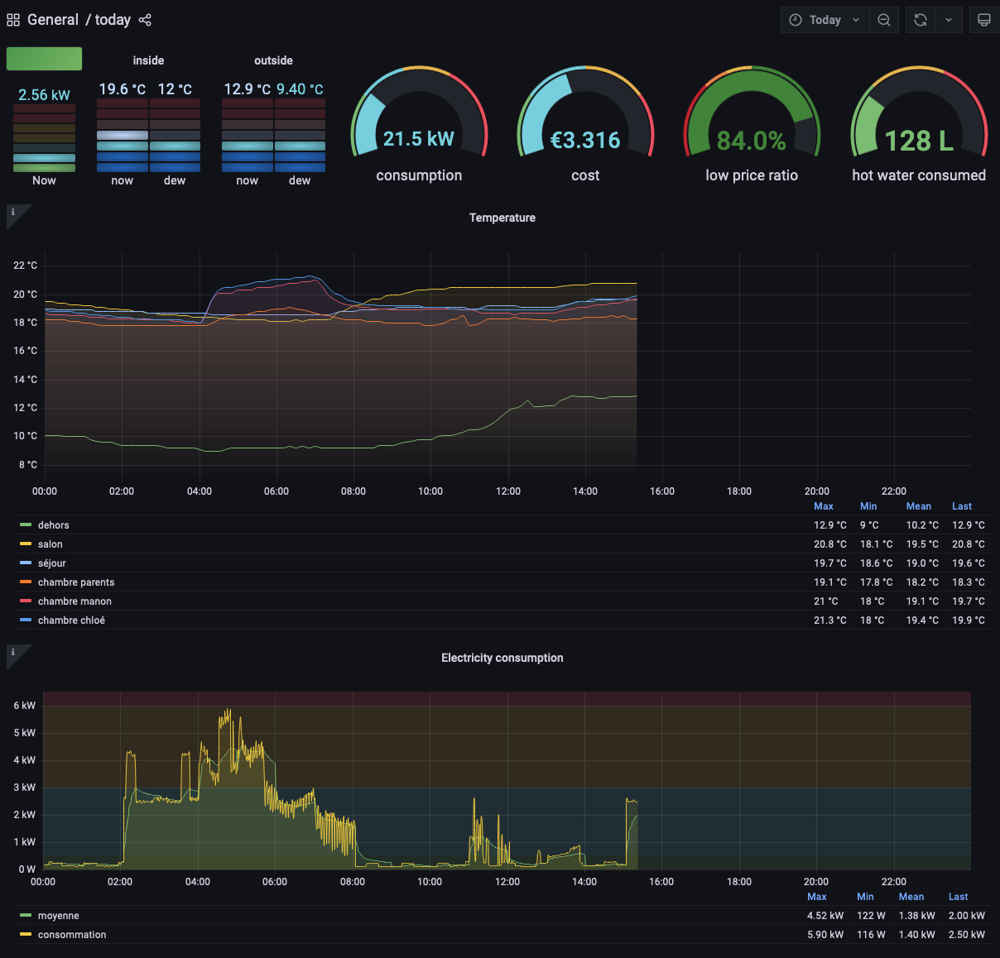
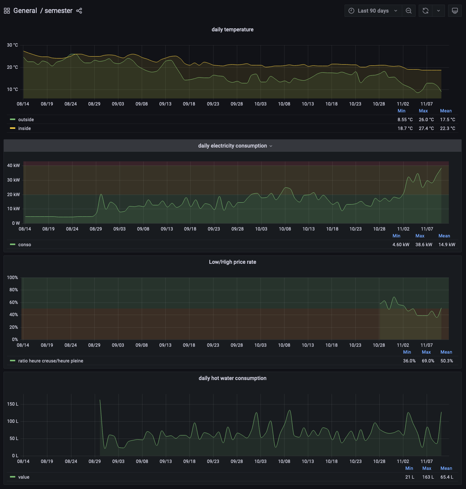
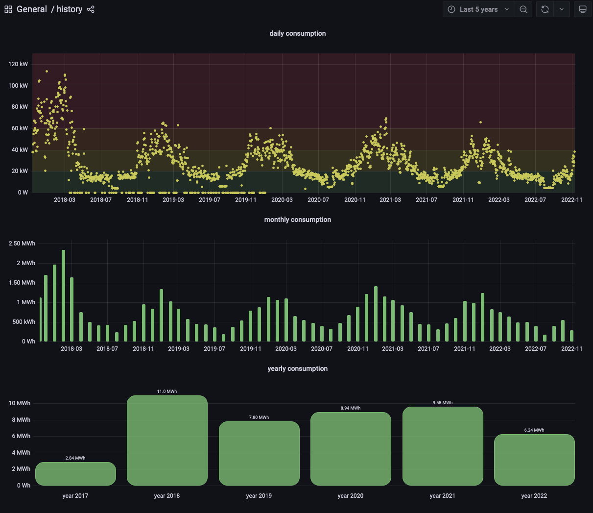

# How to display data history

OK! So we have new sensors 👍

Also, they publish logs over MQTT.

[Mosquitto](https://stevessmarthomeguide.com/install-mosquitto-raspberry-pi/) works pretty well on Raspberry Pi. It's easy to install and Tasmota allows you to set up all your sensors (@see [temperature sensors](cheapest-temperature-sensor.md)) in a couple of clicks.

Anyway, this piece of puzzle is mandatory to collect data and it's the best option if you want to collect your data.

Honestly, i didn't try to test platforms like [Home Assistant](https://tasmota.github.io/docs/Home-Assistant/) or [openHAB](https://tasmota.github.io/docs/openHAB/) but it seems work on MQTT and offers a lot of graphs that could display your data.

Because I'm not interested by controlling my rolling shutter, bulbs or music with a central platform, I've decided to take the shortest path to get a complete dashboard.

So i've selected three pillars:

- [Mosquitto](https://mosquitto.org/)
- [Grafana](grafana.com/)
- And a lot of glue to bind Mosquitto and Grafana together

## TLDR;

> you can jump to [this page](https://github.com/sylvek/domotik) and grab what you need. If you need help, please [contact me](https://github.com/sylvek/wearesober/issues/new) 🙂

## Glue! 🖇

Well, on one side _Mosquitto_ collects and dispatches data from sensors, on the other _Grafana_ reads data and displays charts.

We have to find a way to store dispatched data in a database and link it to Grafana.

```
[sensors] --> [mosquitto] --> ([glue]+[database]) --> [grafana]
```

I've tested a lot of databases, MySQL, MongoDB, Elasticsearch and InfluxDB. All of them work with Grafana but needs large resources of CPU and Memory. Also, we have to think about backuping, ability to extract easily data to transfer them to an another (i've changed databases type 5 times!), etc.

At the end, I only need 24h of precise data _(48h to fall back in case of issue)_ and some aggregates with a day accuracy to compute summaries.

We are talking about a dozen data per day. Not really a big deal. That's why i decided to create [my own **datastore** system](https://github.com/sylvek/domotik/tree/master/datastore) **based on SQLite3**.

It [connects to Mosquitto, collects, splits and stores data from sensors/+/+ to a sqlite database "sensors.db"](https://github.com/sylvek/domotik/blob/master/datastore/domotik/main.go).

At midnight, a process "reduces" data and stores results into "history.db". It calculates mean temperature and power consumption of the day.

The sqlite databases are directly linked into Grafana thank to [the plugin of Sergej Herbert](https://github.com/fr-ser/grafana-sqlite-datasource).

```
[sensors] --> [mosquitto] --> [datastore]>[sensors.db] --> [dashboard]
                                         >[history.db] --> [dashboard]
```

Backuping a SQLite is pretty simple.

You have to order a `.backup` and target a backup file.
You could do that by using `|` pipe feature from Unix.
The result can be compressed with `gzip` 🙂.

```
> echo ".backup /path/to/backup/history.db" | /usr/bin/sqlite3 /path/to/current/history.db && /bin/gzip -f /path/to/backup/history.db
```

At this point, all sensors publishing data on topic `sensors/(device)/(unit)` will be stored on `sensors.db` _(`select * from data;` returns all data)_.

Sadely, some data needs transformations 😣. Endeed, for the [Linky](https://github.com/sylvek/linkiki/), we only collect `sensors/linky/watt` and `sensors/linky/state`.

It's useful to deduce the current total consumption, the current cost, the current ratio between low and high price, the time spent by the water tank to heat.. water, etc.

So, we need an another component that will apply a set of rules and publish new data. Also, our temperature sensors based on tasmota publish data over `tele/+/SENSOR` topics and we have to translate it into `sensors/(device)/(unit)` format to be relevant.

This [back side does it](https://github.com/sylvek/domotik/blob/master/back/src/main/java/com/github/sylvek/domotik/Application.java) for you.

It [listens two topics](https://github.com/sylvek/domotik/blob/master/back/src/main/java/com/github/sylvek/domotik/DomotikService.java) `sensors/linky/+` and `tele/+/SENSOR`, converts the second on to a `sensors/(device)/(unit)` format and [applies a set of rules for the first one](https://github.com/sylvek/domotik/blob/master/back/src/main/java/com/github/sylvek/domotik/DomotikRulesEngine.java).

```
[sensors] ----------------> [datastore] -> [grafana]
          ---> [back] ----> [datastore] -> [grafana]
```

## You'll need dashboards 📊

Personnaly, i've cooked 3 differents dashboard.

- a fine grained day to day analyze
- a 90days view to feel changes and gains
- a long term view to analyze yearly gains





**Don't worry, i have a copy of my Grafana configuration! 🥳**

You can [download this backup](https://github.com/sylvek/domotik/blob/master/grafana/grafana-backup.tgz?raw=true). It contains my current configuration. You have to unzip and copy the directory on `/var/lib/grafana`.

Or you could use [my docker-compose configuration](https://github.com/sylvek/domotik#build--run-it)🐳.
