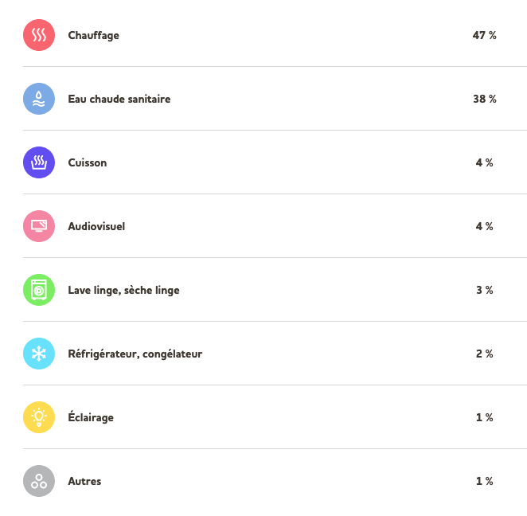
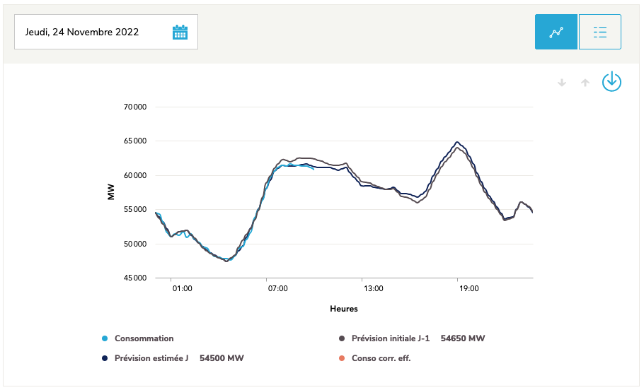
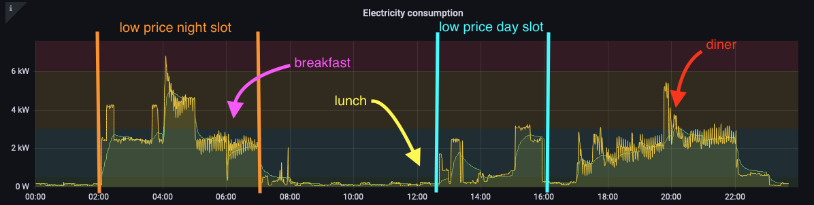
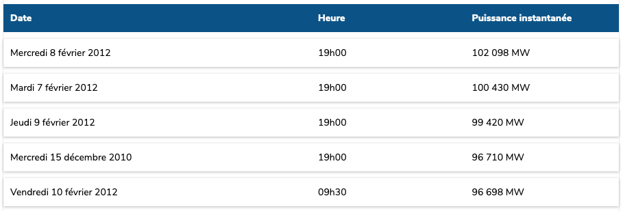
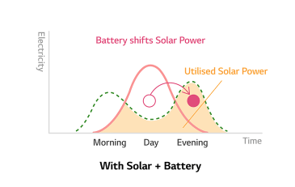
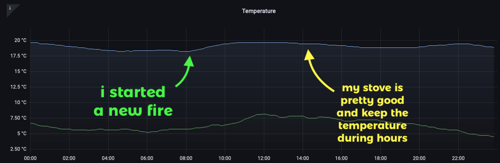
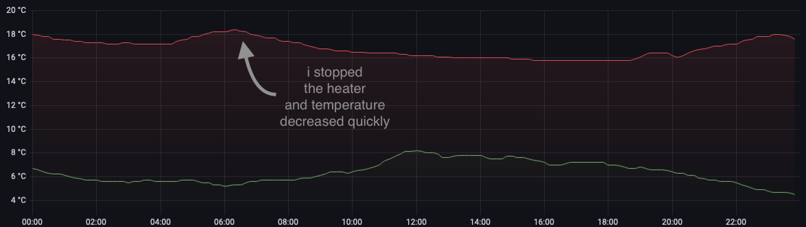
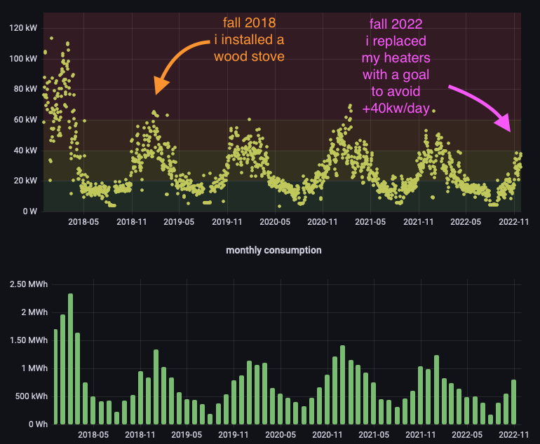
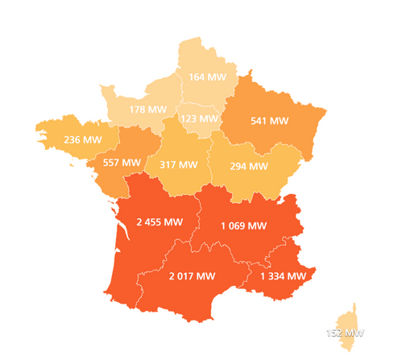

# What I've learned

In a typical french house, we have :

- several electric heaters (for 40% of French houses)
- a hot water tank powered by electricty
- a cook oven
- machines (washing machine, dryer, fridge, etc)
- tv, lights, computers, tablets, phones... lot of usb chargers, etc

**Heat takes up 89% of our consumption!**

Also, we have two types of consumption :

- what it's expected (ex. your tv when you're using it)
- what it is not (ex. your tv on idle mode) (10% of your bill)

## How does it work at home?

| typical day                          | people | consumption |
| ------------------------------------ | ------ | ----------- |
| all off (except fridge)              | no     | 3kW         |
| a winter day (frost protection)      | no     | 7kW         |
| a summer day (without ac)            | yes    | 13kW        |
| a fall/spring day                    | yes    | 25kW        |
| a winter day                         | yes    | 35kW        |
| top max                              | yes    | 60kW        |
| top max (before having a wood stove) | yes    | 100kW       |

I have two dedicated slots at a reduced price, 2am to 7am and 1pm to 4pm.
Also, keep in mind that **we have a peak on evening** (~7pm) in France.

Have a look on thoses figures from a typical November day.

We can split days into three slots. The early morning, where it's easy to produce hot water and heat house at a low price. We also can postpone our lunch and schedule our household chores during the second low price slot _(look above, between 1pm and 5pm, we are in a ramp down)_. But it becomes **difficult to postpone the dinner** and the cozy life during the third slot.

Sadely, That's the main challenge during winter.. Have a look on the French consumption records.

We can reduce the amount of this peak by decreasing temperature in a house, for example. But, it shouldn't remove the peak.

To do it, **we have to "erase" our consumption**.

Basically, we can turn off our heaters and/or avoid to use our oven.
We also could postpone our dinner to 10pm, eat cold foods, do batch cooking during sundays…

OR better, we could supply this energy by a home battery. _(Delayed energy could come from solar panels or your current energy supplier)_ 🤔

So, how much energy do you need?

It depends of course of what dishes you are used to cooking. Well, say you need 30 minutes with an oven, an microwaves oven and an electric hob. Meaning a peak of 3kw during an half hour _(~1500wh with a load at 3000w)_.

## The myth of electric heaters

Basically, I thought that I could reduce my bill by heating as much as possible during my low price window to store calories in my house.

it's a myth, don't to that.

It's possible if you have a good wood stove.

But it's clearly a no go with an electric heater (and i have good ones with a cast iron core) and you'll loose all your gain by doing this.

## The way to produce heat

Transforming electricity into heat is what it consumes the most. Clearly, it's not efficience at all. But in France, we have nuclear power plants and we use it a lot. BTW, we have two options to reduce our electricity dependency :

- insulating our house _(and loosing less calories)_
- using a second way to produce heat _(and producing less calories from electricty)_

It depends on budget :

| DIY                                    | costs              |
| -------------------------------------- | ------------------ |
| Replacing electric heaters by new ones | 1.000€ to 3.000€   |
| Replacing fireplace by a wood stove    | 5.000€ to 7.000€   |
| Replacing windows                      | 5.000€ to 10.000€  |
| Insulating roof                        | 10.000€ to 15.000€ |
| Insulating external walls              | 20.000€ to 40.000€ |

My personal house was already furnished with insulated windows and roof.

I've decided to replace electric heaters and fireplace.

The gain is up to -40% during coolest days but it comes with a price :

- you have to start a fire every day
- you have to daily check your consumption to optimize your configuration
- you have to escort your family to play the game
- and ofcourse, you have to invest 5/10k€ in your installation

## You have to track any wastage of consumption

Don't touch anything.. look! you have some consumptions.
Yes, you haven't turned off your idle computer nor your super HIFI station. Did i already speak about your internet box?
You have a sort of "pillow" of consumption. It's the minimal consumption at home and it could be too high.

For example, before i've been starting chasing wastages, my minimal consumption was around 230w meaning 5500wh consumed a day without doing anything !

After removing old devices and installing smart plugs to control inactive devices, i've divided by 4 my minimal power consumption.

To discover all those wastages, i recommand to use a Power Meter Plug.
[But if you can you'll have a better view by using a global power meter plugged on your central station (like a Linky)](collect-data-from-linky.md).

## Is it interesting to install solar panels?

It depends on your home location.
Around Paris, it's not an obvious option and you'll earn more money by chasing wastage.

Ok and again "it demands", but set upping a global solar installation _(with ups system)_ is very expansive, around 15.000€ to 20.000€.

The basic rule is : "you gain xxx kwh/year for a xxx watt solar panel".
So, for panels with a capacity of 3000 watts, you'll produce 3000 kwh/year.

| Power | cost               |
| ----- | ------------------ |
| 3kWc  | 9.000€ to 13.000€  |
| 6kWc  | 16.000€ to 19.000€ |
| 9kWc  | 25.000€ to 30.000€ |

For example, my personal annual consumption is around 9MWh. I could reduce it by set upping 3kWc on my roof, but it's not that simple. Indeed, look back to this chart.

Highest solar production is produced during a day when we have the lowest usage.
So 3kWc doesn't mean annual 3000kwh in production but only 1000kwh !

**You have to store your own production and consume it at the good moment**

So we need a battery, and a big one. I suppose the best fit is 3 times larger than your installation. But in reverse, if your battery is too large you'll not fill in totally every day and it should be counter productive. 🤔

Well, 3kWc on the roof and a home battery with a capacity of 9kw with a loading rate of 90% : we could store around 3Mwh for a given price of 10k€ for solar panel and 5k€ for the battery. Let's say 15.000€ for cutting down my bill by 30%.

I pay ~1300€/year of charges, i could gain 400€ a year. I need more than 30 years to pay back my investment 🤔.

# (temporal) conclusion

Late 2022, electricity prices are frozen for a few months while waiting for spring of 2023 to return as a main topic.

Unless having electricity prices based on the SPOT market, we'll not involved to become sober.

The main purpose is to **reduce/eliminate consumption between 6pm to 8pm**. Indeed, this is the niche where electricity is produced using fossil fuels and there is a drastic lake of green alternatives.

Sadly, we can't democratize the use of local batteries because of the price and the the lifespan of the equipments.

**BUT**, small steps count. But focusing on reducing waste, you'll gain more than investing in self-consumption solar panels. **In addition**, using an alternative way of producing heat makes it possible to reduce electricity during times when green energies are lacking.

# next steps

- Explore to use solar panels to power hot tank water
- Explore the build of a small capacity battery to eliminate peak consumptions
- Explore possibilities to trade green cheap electricity by green expansive electricity
- (to be continued)
